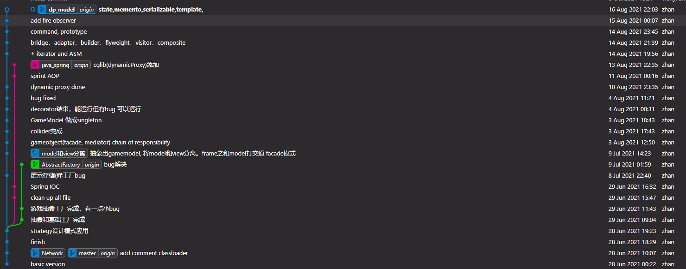
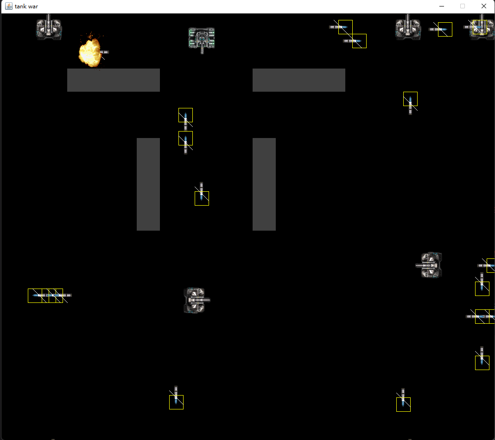

# Tank-battle
## Introduction
Control you tank and shoot to destory other tank. 
For testing, your tank is indestructible.  
Implementing a lot of design patterns to improve readability and extendibility.  
Also including Sring( AOP, IOC etc.) to learn and try to implement this game by using it.
## Control
By pressing `WASD` to control the move of your tank.  
By pressing `J` to shoot bullets.
## Program details

To run the program as the image below, go to the dp_model branch and proceed running (even build failed due to some design pattern learning code in DesignPattern folder outside the program code).  
Branch `AbstractFactory` for implementing **AbstractFactory** design pattern.  
Branch `dp_model` for other design pattern including **proxy, singleton, iterator, ASM, state, memento, serializable, template, observer, command, prototype, bridge, adapter, builder, flyweight, visitor, composite**. For example, use **observer** for bullet fire and destory, **chain of responsibility** for collision test, **strategy** on different type of firing, etc.  
Branch `java_spring` including Spring framework. For example Spring AOP (cglib dynamic proxy) and Spring IOC etc.
## Example

Bullet already applied RectDecorator and TailDecorator for testing(those class can find in ./com/zhan/tank/decorator folder)
